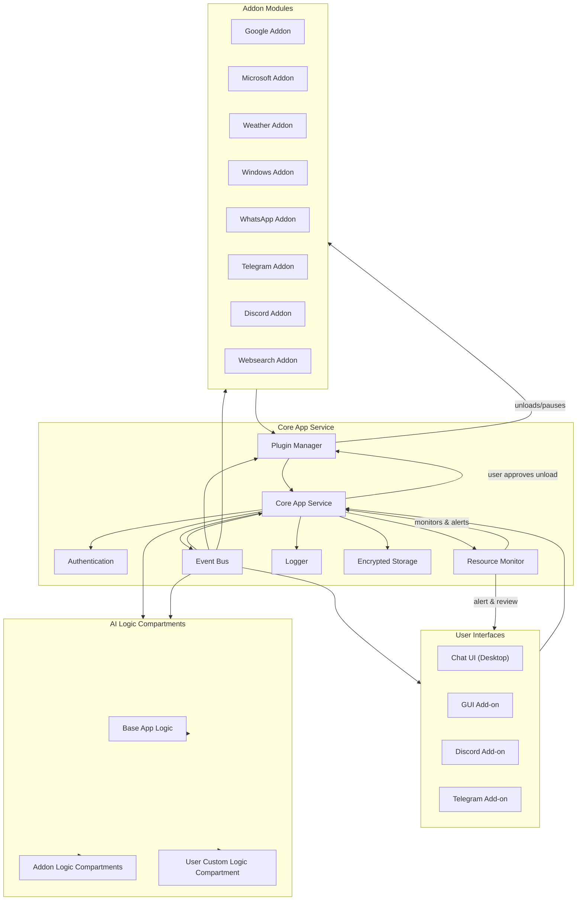

# VPA (Virtual Personal Agent) – Final Architecture & Solution Overview

## 1. **Project Vision & Purpose**
VPA is a modular, agentic automation platform designed to empower users to automate personal and business workflows, manage communications, organize information, and interact with multiple systems—all via a powerful conversational interface.

---

## 2. **Core Principles**

- **Modularity:**  
  Addons are self-contained modules (Google, Microsoft, WhatsApp, Telegram, Discord, Weather, Windows, Websearch) that users activate as needed.
- **Agentic Automation:**  
  The agent can understand, break down, and execute complex user commands, automating multi-step workflows with live previews and approvals.
- **Compartmentalized Logic:**  
  All automation logic is compartmentalized into three areas:  
    - Base app logic (core functions)  
    - Addon logic (per active addon)  
    - User logic (custom workflows, agent-assisted programming)
- **Minimal User Input:**  
  Setup and onboarding for addons require only essential information (typically email/password, or guided OAuth if needed). The agent automates all integration steps.
- **Event-Driven:**  
  A central event bus orchestrates communication, parallel task execution, and logical task splitting to ensure accuracy and responsiveness.
- **Resource Monitoring & User Control:**  
  Resource monitor tracks CPU, RAM, GPU, and storage usage. When strain is detected, the system only unloads or pauses plugins/addons with clear user consent—never automatically.

---

## 3. **High-Level Architecture**

### **A. Core App Service**
- Central logic and processing
- Manages authentication, resource monitoring, plugin/addon manager, AI logic compartments, event bus, logging, encrypted data storage

### **B. User Interfaces**
- Chat UI (desktop)
- GUI Add-on
- Discord Add-on
- Telegram Add-on
- (others in future)

### **C. Addon Modules**
- Google (Gmail, Drive, Calendar, etc.)
- Microsoft (Outlook, OneDrive, Office, etc.)
- WhatsApp
- Telegram
- Discord
- Weather
- Windows OS automation
- Websearch

### **D. AI Logic Compartments**
- **Base AI Logic:**  
  Core automation and app management, file/query/history/tasks
- **Addon AI Logic:**  
  Addon-specific automation/workflows, loaded only when active
- **User AI Logic:**  
  Agent-guided, user-defined custom workflows; conversational builder, preview, approval, storage, and execution

### **E. Event Bus**
- Central dispatcher for all commands/events
- Supports async, parallel execution and priority ordering
- Ensures logical splitting and ordered execution of tasks

### **F. Resource Monitor**
- Tracks CPU, RAM, GPU, storage usage (and optionally network)
- Alerts user about resource strain
- Only unloads/pauses plugins/addons with explicit user consent
- Provides simple, user-friendly resource management UI
- Keeps a history of resource actions

---

## 4. **Feature Highlights**

- **Addon Activation:**  
  User toggles addon on/off, agent assists with setup and automates integration.
- **Custom User Workflows:**  
  Users can create, edit, save, and execute bespoke workflows with agent assistance, stored in User AI Logic compartment.
- **Live Preview & Approval:**  
  For complex automations (e.g., email or document creation), agent presents previews for user review and comment before final action.
- **Universal Automation:**  
  Agent can automate any app-related task—settings, calibration, LLM/model download, history queries, file management, etc.
- **Security & Privacy:**  
  Permission prompts for sensitive actions, audit logs, session management.
- **Extensibility:**  
  Easy onboarding for new addons/plugins, clear documentation/specs for third-party development.

---

## 5. **Information Flow Example**

1. **User Command:**  
   "Send the latest meeting minutes to the team, aligned to our format."
2. **Event Bus:**  
   Breaks command into logical tasks, routes to relevant logic compartments.
3. **AI Logic:**  
   - Pulls meeting recording, transcribes, formats document
   - Summarizes and aligns to template
   - Updates attendance, time, references
   - Prepares email, attaches document
   - Shows preview for user review/approval
   - Sends email once approved
4. **Resource Monitor:**  
   Ensures optimal performance, alerts user if strain is detected, and only unloads plugins/addons with user approval.

---

## 6. **Compartmentalization Diagram (Fixed Mermaid Syntax)**

---

## 7. **Checklist of Finalized Features**

- [x] Modular, compartmentalized logic (base, addon, user)
- [x] Self-contained, user-activated addons (Google, Microsoft, etc.)
- [x] Conversational agentic automation (multi-step, accurate, preview/approval)
- [x] Agent-assisted custom workflow creation and execution (User AI Logic compartment)
- [x] Central event bus for task orchestration and parallelism
- [x] Resource monitoring (CPU, RAM, GPU, storage) with explicit user control
- [x] Security, privacy, auditability
- [x] Extensible for future addons and workflows

---

## 8. **Next Steps**

- Use the coding agent to assess current app for alignment with this architecture.
- Identify and list every required change or addition to fully implement the finalized solution.
- Prioritize implementation roadmap and begin code updates.

---

_Last updated: July 16, 2025 by AI Development Assistant_

**Ready for assessment and implementation.**
