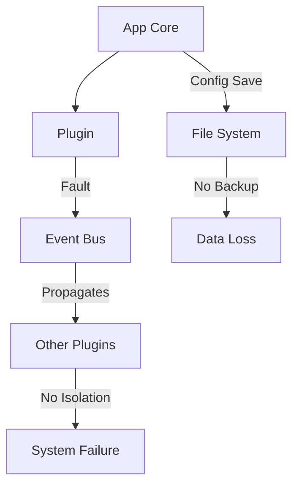
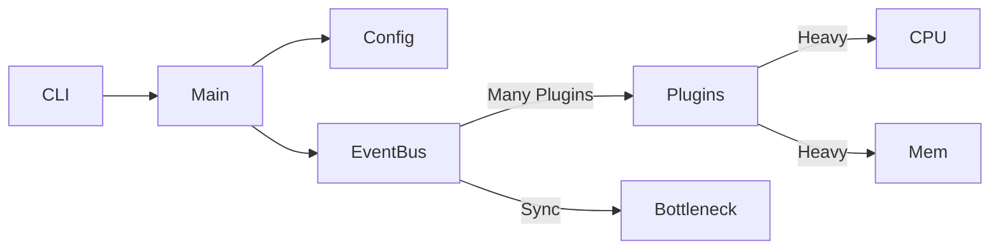
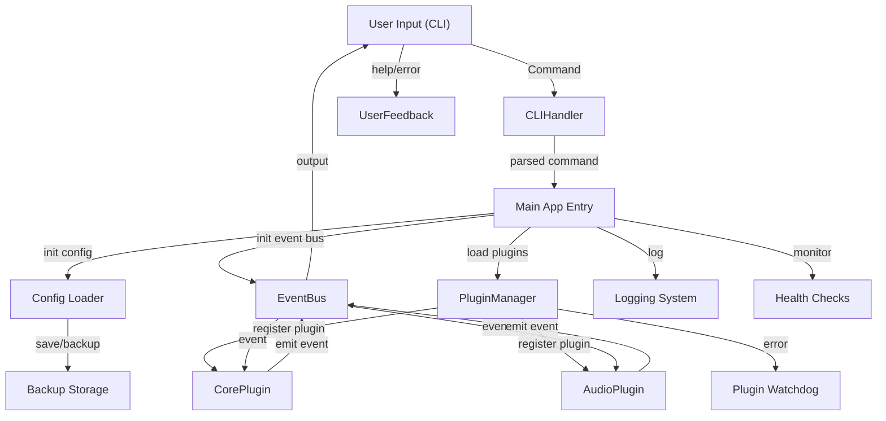

# VPA Project Architecture Analysis – Comprehensive Feedback & Workflow Review

---

## 1. What Your Application Does & How

**Summary:**  
Your Virtual Personal Assistant (VPA) is a modular, event-driven Python application designed for extensibility, maintainability, and testability. It features a CLI interface, robust plugin architecture, and a strong internal event bus for decoupled component communication.

### **Logical Flow Diagram**

```mermaid
flowchart TD
    A[User Input (CLI)] --> B[CLI Handler]
    B --> C[Main App Entry]
    C --> D[Config Loader]
    C --> E[Event Bus]
    C --> F[Plugin Manager]
    F --> G[Core Plugins]
    F --> H[Audio Plugin]
    E --> G
    E --> H
    G --> I[App Services]
    H --> J[Audio Services]
    I --> E
    J --> E
    E --> K[CLI Output]
    K --> A
```

### **How It Works:**
- **Startup**:  
  CLI or main.py initializes config, sets up the event bus, and loads plugins.
- **Event Bus**:  
  All inter-component communication is routed through a central event bus, enabling decoupling and asynchronous operations.
- **Plugin System**:  
  Dynamically loads and manages plugins (e.g., audio, core functions), allowing easy extension.
- **Configuration**:  
  Uses centralized config management for all runtime settings.
- **Testing**:  
  Comprehensive test suite covering all core logic.

---

## 2. Overdesigned Elements

- **Plugin Architecture**:  
  For a small/medium app, a full plugin system may be too heavy. If you anticipate only a few plugins under your control, consider a simpler module approach.
- **Event Bus**:  
  Powerful for complex apps but adds cognitive and runtime overhead if most communication is simple.
- **Development Tools**:  
  Dedicated code analysis, plugin generation, and project scanning tools may be more than needed unless you have large, distributed teams or open source contributors.

---

## 3. Underdesigned & Missing Operations/User Experience

- **User Feedback & Error Handling**:
    - CLI lacks interactive help, onboarding, and clear error feedback.
    - No mention of fallback flows or user guidance on failures.

- **Health Monitoring & Logging**:
    - Lacks structured logging, real-time health checks, and alerting.
    - No operational dashboards or metrics for performance monitoring.

- **Config Security**:
    - No explicit secret management (e.g., .env, vaults), no runtime validation for misconfig.

- **Session/State Management**:
    - No persistent user/session data, meaning no continuity or personalization.

- **Recovery & Redundancy**:
    - No process watchdogs, restart logic, or backup mechanisms for config/state.

- **Accessibility & Internationalization**:
    - No multi-language or accessibility features.

---

## 4. Failsafes and Redundancies for Data Loss/Integrity

### **What Exists:**
- **Testing:** 100% coverage in core modules; strong regression defense.
- **Config Management:** Centralized, reducing risk of config drift.
- **Decoupling:** Event bus isolates failures to individual components.

### **What's Missing:**
- **State/Config Backups:** No automated backup/restore for config or persistent state.
- **Transactionality:** No atomic writes for config/state updates.
- **Health Monitoring:** No self-healing, heartbeat, or process supervision.
- **Audit Logging:** No comprehensive logging for debugging or compliance.
- **Plugin Isolation:** No sandboxing—faulty plugins can crash or corrupt the app.

### **Diagram: Failsafe Gaps**



---

## 5. Information & Data Flow: How the System "Thinks"

**Current Info Flow:**
- User (CLI) → CLI Handler → Main → Config/Event Bus/Plugin Manager
- Plugins receive/emit events via Event Bus
- App state primarily in-memory; config read at startup

**Where It Breaks:**
- **Error Propagation:** If a plugin fails, it can bring down the app—no isolation or error boundaries.
- **No Persistent Context:** User sessions and states are not saved, so context is lost between runs.
- **No External Monitoring:** No feedback loop for alerting on failures or degraded performance.

---

## 6. Resource Bottlenecks & Overhead

**Resource-Hungry Mechanics:**
- **Plugin & Event Bus Overhead:**  
  Each plugin and event requires memory and CPU; for small feature sets, this is unnecessary overhead.
- **No Lazy Loading:**  
  All plugins may load at startup even if not needed, increasing memory usage.
- **No Async I/O Management:**  
  Event bus may block on slow plugins or I/O, creating bottlenecks.

**Diagram: Potential Bottlenecks**



---

## 7. Best Practices for AI/Agent & Integration Workflows

**AI Chatbot/Agent:**
- **Input Filtering:** Always sanitize and validate all user input before sending to any AI or NLP model.
- **Context Management:** Preserve user/session context for multi-turn conversations.
- **Fallbacks:** Provide default responses or escalate when the AI is uncertain.
- **Rate Limiting:** Prevent infinite loops or abuse in agent logic.
- **Audit Logging:** Track all AI calls and responses for compliance and debugging.

**Microsoft/Google Integration:**
- **OAuth2 & Token Security:** Never store credentials in code; rotate and secure all tokens.
- **Quota/Error Handling:** Gracefully handle API rate limits and transient errors with retries/backoff.
- **Least Privilege:** Only request permissions absolutely necessary for each integration.
- **Audit Trails:** Log all API actions for monitoring and compliance.
- **Compliance:** Ensure all data handling aligns with GDPR/CCPA and enterprise security requirements.

---

## 8. Expansion Potential & What's Needed

**Current Design Supports:**
- Adding plugins for new features (e.g., AI, voice, integrations)
- Easy code updates and test-driven improvements

**Can Be Expanded To:**
- **Web/GUI interfaces:** Using event bus/plugin system for UI events
- **AI/NLP Features:** Plugins for LLMs, text-to-speech, etc.
- **Enterprise Integrations:** Plugins for MS 365, Google Workspace, Slack, etc.
- **Automation/Workflow:** Orchestration plugins for business logic/tasks

**What's Needed for Each:**
- **Process Isolation:** For untrusted or 3rd-party plugins, use subprocesses or containers.
- **Scalable Storage:** For persistent logs, state, and context.
- **User and Session Management:** To support multi-user, multi-session use cases.
- **Health and Audit Monitoring:** For operational tracking and compliance.
- **Robust Error Handling:** For all user and system-level errors.

---

## 9. Actionable Recommendations

| Category         | Current Gaps                             | Recommendation                          |
|------------------|------------------------------------------|-----------------------------------------|
| **CLI UX**         | No onboarding/help, poor error feedback | Add interactive help, onboarding, clear errors |
| **Security**       | No secret management, plugin isolation  | Implement .env/secure vault, sandbox plugins  |
| **Ops/Monitoring** | No structured logs, no health checks    | Add structured logging, health endpoints     |
| **Persistence**    | No backups, no session state            | Implement backup/restore, add session mgmt  |
| **Performance**    | All plugins load, event bus overhead    | Lazy load plugins, review event bus need    |
| **Integration**    | No retry/backoff, no audit trails       | Add retries, audit logging, compliance review|
| **Error Handling** | Plugin error brings down app            | Add plugin error boundaries and graceful fallback |

---

## 10. Expanded Logical Flow & System Diagram

### **Pictorial: Enhanced System View**



**Legend**:  
- *Dashed lines* = missing or underdeveloped features  
- *Bold* = critical data or error flows

---

## 11. Where the System "Thinks" and How to Improve

**Current "Thinking":**
- Follows strict event-driven, modular processing.
- All logic routed through event bus, plugins can extend or modify behaviors.

**Shortcomings:**
- Lacks adaptive intelligence for error recovery, resource scaling, and dynamic user/session management.
- No high-level orchestration or self-healing logic—relies on static plugin/event flow.

**How to Make It Think Better:**
- Add **adaptive workflows**: Plugins or core logic that adapts based on user/session history or operational health.
- Implement **resource-aware plugin loading/unloading**.
- Add **self-healing**: Automatic restart or isolation of failed plugins/services.
- Use **AI-driven routing**: Direct events or commands to best-fit plugin or handler based on context.

---

# In Summary

**Your VPA app is an excellent, extensible platform designed for modularity and reliability.**  
But:  
- You can simplify the architecture if only a few features are needed.
- Focus on user-facing UX, operational health, and security.
- Add persistence, monitoring, and plugin/process isolation for future growth.
- For enterprise integrations and AI, follow strict security, privacy, and compliance practices.

**Your next best steps:**  
- Harden the CLI and plugin security boundaries.
- Add user/session state and backup/restore mechanisms.
- Implement structured logging, health checks, and monitoring.
- Refactor for lazy plugin loading and more efficient use of the event bus.

**By doing this, you'll create a robust, maintainable, and scalable assistant ready for both personal and enterprise deployment.**
